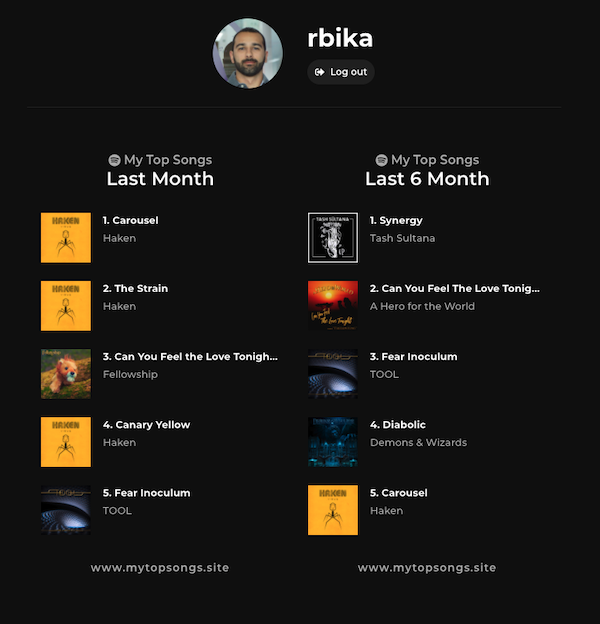

# Spotify Top Songs


Discover what songs you've been listening to the most on Spotify.



## Development

1. Follow [these instructions](https://developer.spotify.com/documentation/general/guides/app-settings/) to register an app in the Spotify for Developers and get a client ID.

1. Clone the repository:

   ```
   git clone https://github.com/rbika/spotify-top-songs.git
   ```

1. Change directory:

   ```
   cd spotify-top-songs
   ```

1. Create a `.env` file at the root of the project and add the following content:

   ```
   REACT_APP_BASE_URL=http://localhost:3000
   REACT_APP_SPOTIFY_CLIENT_ID=your_client_id
   ```

1. Install the dependencies:

   ```
   npm install
   ```

1. Run the development server:

   ```
   npm start
   ```

1. App will be running on http://localhost:3000.

## Deployment

### Github configurations

1. In the Github project's page, go to Settings → Secrets → Add new secret.
2. Add the following secrets with their respective values:
   - `SPOTIFY_PROD_CLIENT_ID`
   - `SPOTIFY_STAGING_CLIENT_ID`
